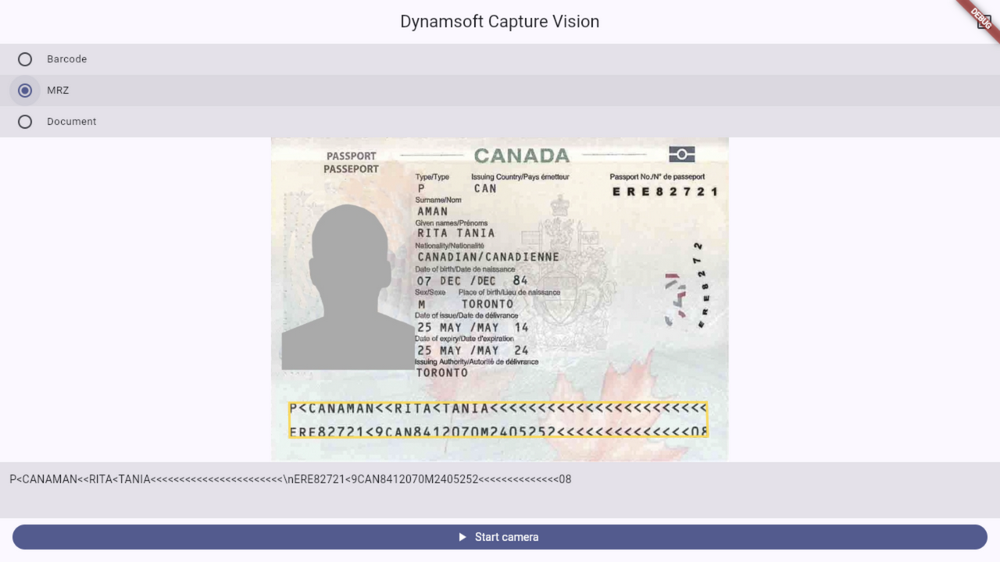

# flutter_capture_vision

[](https://pub.dev/packages/flutter_capture_vision)
[](https://github.com/yushulx/flutter_capture_vision/blob/main/LICENSE)

A cross-platform Flutter plugin for barcode reading, MRZ (passport/ID) recognition, and document boundary detection, powered by [Dynamsoft Capture Vision](https://www.dynamsoft.com/capture-vision/overview/). Supports **Android**, **iOS**, **Web**, **Windows**, **Linux**, and **macOS**.



The plugin wraps the Dynamsoft Capture Vision SDK of each platform behind one stable Dart API. It accepts image **files** or **raw pixel buffers**, so it composes with any camera plugin — for example [`flutter_lite_camera`](https://pub.dev/packages/flutter_lite_camera) for live preview and frame capture.

## Getting Started

### 1. Install the Package

```yaml
dependencies:
  flutter_capture_vision: ^0.1.0
```

The Android, iOS, Web, Windows, macOS, and Linux implementations are endorsed federated packages and are selected automatically — depend only on `flutter_capture_vision`.

### 2. Obtain a License Key

A valid license is required to activate barcode, MRZ, and document detection.

[](https://www.dynamsoft.com/customer/license/trialLicense/?product=dcv&package=cross-platform)

### 3. Initialize the SDK

```dart
import 'package:flutter_capture_vision/flutter_capture_vision.dart';

final vision = FlutterCaptureVision();
await vision.initialize(licenseKey: 'YOUR-LICENSE-KEY');
```

## Usage

### Capture from an Image File

```dart
final result = await vision.captureFile(
  '/path/to/image.jpg',
  const CaptureVisionRequest.forTasks({VisionTask.barcode}),
);

for (final barcode in result.barcodes) {
  print('${barcode.format}: ${barcode.text}');
}
```

### Capture from a Camera Buffer

```dart
final result = await vision.captureBuffer(
  VisionImageBuffer(
    bytes: rgbBytes,       // Uint8List
    width: width,
    height: height,
    stride: width * 3,
    pixelFormat: VisionPixelFormat.rgb888,
    rotation: VisionRotation.degrees0,
  ),
  const CaptureVisionRequest.forTasks({
    VisionTask.barcode,
    VisionTask.mrz,
    VisionTask.documentDetection,
  }),
);
```

`CaptureVisionResult` always returns non-null lists; "nothing found" is an empty list. Failures (license, invalid input, native SDK errors) throw `CaptureVisionException(code, message)` with a stable machine-readable `code`.

## Vision Tasks

| Task | Built-in template | Results |
| --- | --- | --- |
| `VisionTask.barcode` | `ReadBarcodes_Default` | `result.barcodes` |
| `VisionTask.mrz` | `ReadPassportAndId` | `result.mrzResults` |
| `VisionTask.documentDetection` | `DetectDocumentBoundaries_Default` | `result.documentDetections` |

MRZ results carry the composed `rawText`, the parsed `fields` (passport number, date of birth, …), and the `documentType` (`MRTD_TD3_PASSPORT`, `MRTD_TD1_ID`, …). Passports and ID cards need reasonably sharp, high-resolution input — request at least 1080p from the camera for MRZ scanning.

## Custom Settings

Advanced users can replace the built-in templates with a Dynamsoft Capture Vision template JSON:

```dart
final templates = await vision.initSettings(settingsJson);   // returns parsed template names
final result = await vision.captureFile(
  path,
  CaptureVisionRequest.namedTemplate(templates.first.name),
);
await vision.resetSettings();                                // restore factory defaults
```

## Platform Notes

- **Android**: `minSdkVersion 21`.
- **iOS**: requires iOS 13+; add `NSCameraUsageDescription` when using a camera plugin.
- **Web**: serve over HTTPS or `localhost`. The JS/WASM/models bundle is self-hosted as package assets — no CDN `<script>` tag is needed.
- **Windows/Linux/macOS**: the released app bundle carries the DCV libraries and resources; see each platform package README for details.

## Examples

Each package ships a runnable example app:

```bash
cd example
flutter run                 # Android/iOS desktop or device
flutter run -d chrome       # Web
flutter run -d windows      # Windows/Linux/macOS
```

The [facade example](https://github.com/yushulx/flutter_capture_vision/tree/main/packages/flutter_capture_vision/example) is the full six-platform demo with live camera capture, annotation overlay, and document export.

## License

See [LICENSE](LICENSE).
